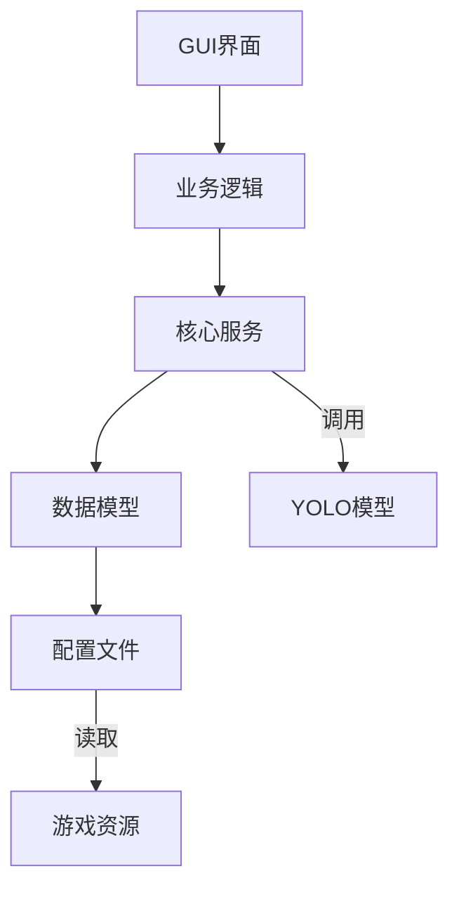
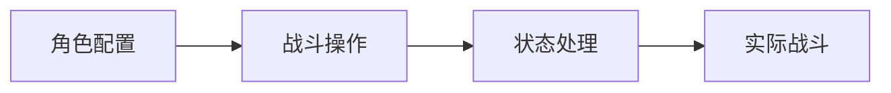

# ZenlessZoneZero-OneDragon 项目结构文档

## 核心目录结构

```
├── assets/                  # 游戏资源文件
│   ├── game_data/           # 游戏数据配置(YAML格式)
│   │   ├── agent/           # 角色配置文件(每个角色一个yml)
│   │   ├── hollow_zero/     # 空洞挑战配置
│   │   └── *.yml            # 全局游戏数据配置
│   ├── models/              # 机器学习模型
│   ├── template/            # 图像模板
│   └── ui/                  # 界面素材资源
│
├── config/                  # 用户配置文件
│   ├── auto_battle/         # 自动战斗配置
│   │   ├── operation/       # 角色操作配置
│   │   └── state_handler/   # 状态处理配置
│   ├── dodge/               # 闪避配置
│   └── hollow_zero/         # 空洞挑战配置
│
├── service/                 # 核心服务
│   ├── zzz_data_model.py    # 数据模型
│   └── zzz_shared_battle_service.py  # 战斗服务
│
└── src/                     # 源代码
    ├── zzz_od/              # 主程序代码
    │   ├── application/     # 功能模块
    │   ├── auto_battle/     # 自动战斗逻辑
    │   ├── gui/             # 图形界面
    │   └── yolo/            # 图像识别相关
    └── onnxocr/             # OCR识别模块
```

## 关键文件说明

### 启动文件
- `one_dragon.bat` - 主启动脚本
- `app.bat` - 备用启动脚本
- `env.bat` - 环境变量配置

### 核心代码
- `src/zzz_od/application/zzz_one_dragon_app.py` - 主程序入口
- `src/zzz_od/gui/app.py` - 图形界面主窗口
- `service/zzz_shared_battle_service.py` - 战斗核心服务

### 配置文件
- `config/project.yml` - 项目全局配置
- `assets/game_data/agent/*.yml` - 角色配置
- `config/auto_battle/*.sample.yml` - 战斗配置模板

## 核心架构



主要模块交互流程：
1. 用户通过GUI界面触发操作
2. 业务逻辑处理用户请求 
3. 核心服务协调各模块工作
4. 数据模型维护游戏状态
5. 配置文件定义行为规则
6. 游戏资源提供素材支持

## 服务模块

| 文件 | 功能 | 依赖 |
|------|------|------|
| `zzz_data_model.py` | 维护游戏核心数据 | 配置文件 |
| `zzz_shared_battle_service.py` | 战斗逻辑处理 | 数据模型,YOLO |
| `zzz_syn_battle_service.py` | 战斗同步服务 | 共享战斗服务 |

## 配置系统



配置层级关系：
- 角色基础属性 (agent/*.yml)
- 战斗操作模板 (auto_battle_operation/)
- 状态处理逻辑 (auto_battle_state_handler/)

## 文件类型统计
- YAML配置文件: 86个
- Python源代码: 63个
- 批处理脚本: 5个
- 图片资源: 24个
